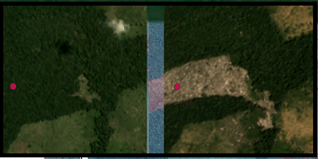

.. DefPointValidator documentation master file, created by
   sphinx-quickstart on Sun Feb 12 17:11:03 2012.
   You can adapt this file completely to your liking, but it should at least
   contain the root `toctree` directive.

Welcome to DefPointValidator's documentation!
============================================
This pluging help to validate deforestation points
using RGB 4.7m/pix images from Planet Labs month mosaics.
Is based on computer vision tools and its inovator because
not use spectral analisis of images.

About
============================================
This plugin was build as product of master degree final project in the
MINE Uniandes Colombia master program in colaboration with IDEAM.

The main contributors were:
Gustavo Becerra, Harry Torres, Ricardo Santamaria, Maria Castro
and Gustavo Galindo.

Is in test version the clasification accuracy is actualy about 75%

Contents:

.. toctree::
   :maxdepth: 2
   :caption: Contents:

   code

Indices and tables
==================

* :ref:`genindex`
* :ref:`modindex`
* :ref:`search`

